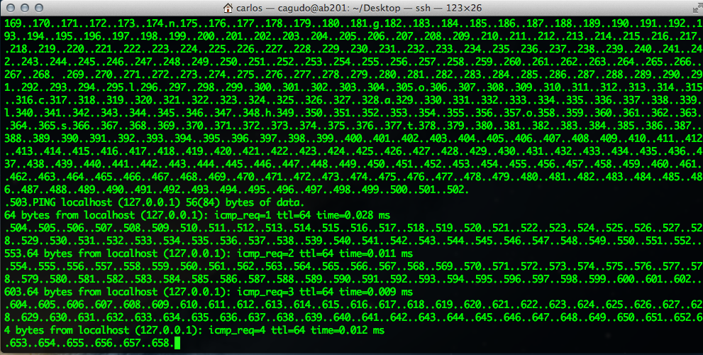
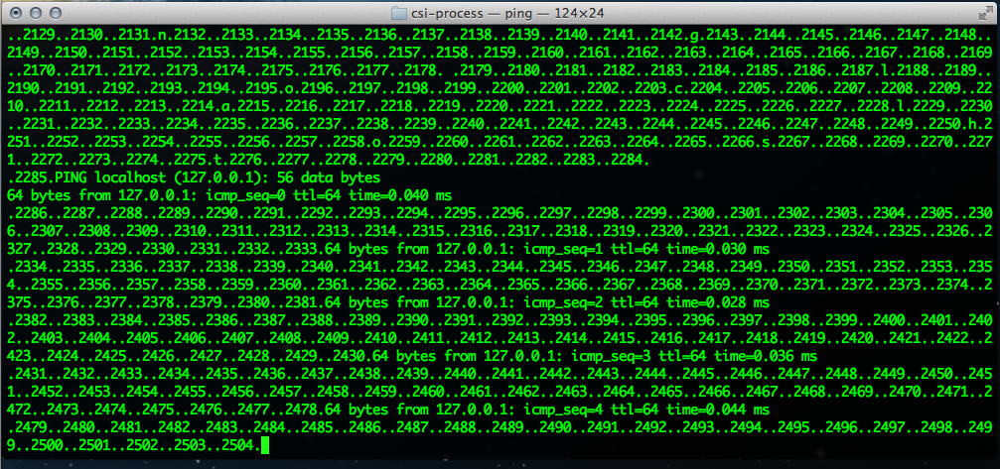
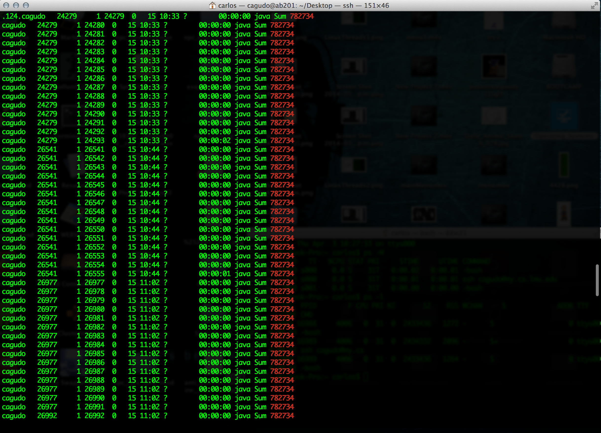
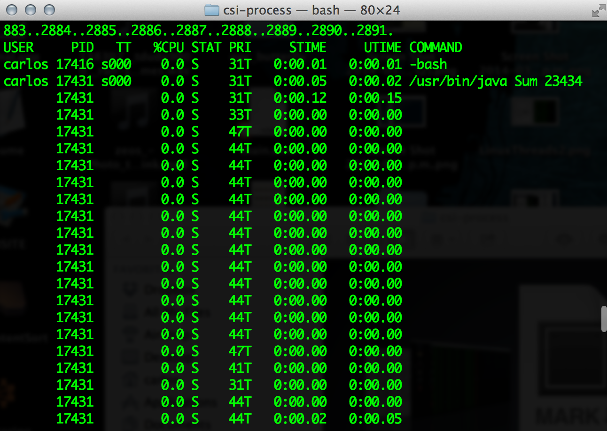

#“CSI: Process”	

##1 Big hot mess

###Linux



###Mac




##2 Display Threads

###Linux



###Mac

 
````````````````````````````
        comment about threads
````````````````````````````

> JD: Yes, please, do comment about them! `:-P`
